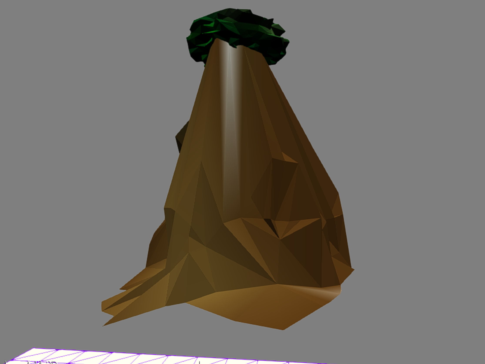

Speed Paint

Author: Ben Cagan (bcagan)

Design: Re-claim as much of the map as you can in the time limit! Claim
as much of the map as you can and get to the needed percentage in the time limit.

Screen Shot:

How To Play:

Walk around with WASD, and try to cover as much area (as many vertices) of the walkable area (originally blue) to turn it
into orange, as you can before the time runs out. NOTE: Color not implemented

Sources: lesson 8, walkmesh solutions shared and worked on by the class in the class' discord.

This game was built with [NEST](NEST.md).

